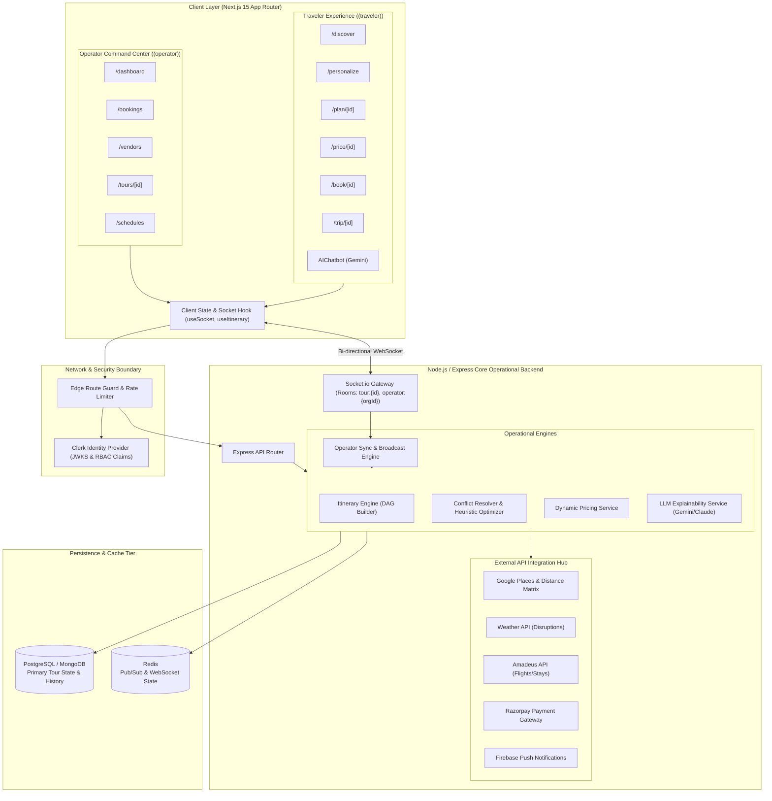
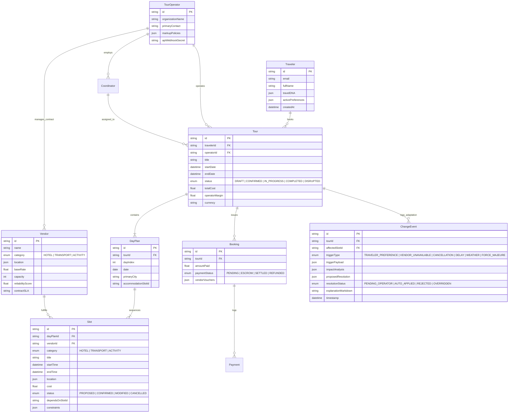
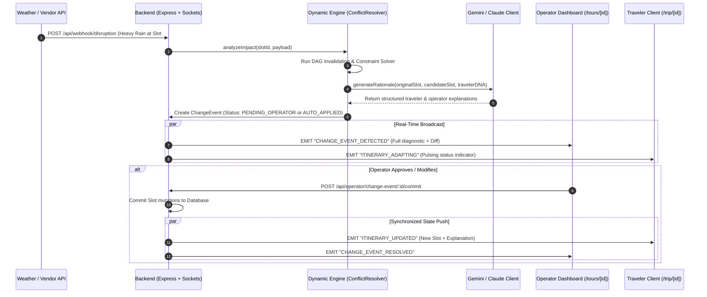

# TourPlatform (Roamly) — System Architecture Document
**Version:** 2.0  
**Classification:** Technical Architecture Specification  
**Ecosystem:** Unified B2C & B2B Dynamic Travel Management Engine  

---

## 1. Executive Summary & Core Thesis

### 1.1 The Underlying Thesis
Traditional tourism has historically forced a harsh binary:
1. **Fixed Packages:** Rigid, pre-bundled itineraries that optimize operator control, vendor bulk rates, and predictable logistics at the cost of zero traveler personalization.
2. **Independent Custom Travel:** Extreme traveler flexibility that creates fragmented bookings, manual operator overload, and total chaos whenever unexpected disruptions occur.

**Roamly’s Architectural Mandate:**  
> *"Shift tourism from static, fixed-package offerings to personalized, dynamically managed journeys—while providing tour operators with equal or greater operational control, real-time visibility, and automation than fixed packages ever offered."*

### 1.2 Two User Types, One Single Connected System
Roamly is deliberately designed as a **single, unified platform** rather than two disconnected applications with clunky API bridges:
* **The Traveler:** Expresses preferences, discovers destinations, customizes day-by-day components, compares trade-offs, and experiences their journey with an adaptive in-pocket assistant.
* **The Tour Operator:** Retains an omniscient multi-tour command center, manages vendor contracts and allocations, coordinates ground personnel, monitors real-time disruptions, and oversees automated or human-in-the-loop adaptation pipelines.

Both actors operate against a **single shared state graph** synchronized in sub-second latency through WebSockets, backed by automated constraint solvers and LLM explainability agents.

---

## 2. System Directory & Monorepo Structure

The platform is structured as a unified monorepo (`tour-platform/`) dividing concerns across frontend client, backend engine, shared contracts, and documentation:

```text
tour-platform/
├── client/                          # Next.js 15+ App (Traveler + Operator UI)
│   ├── app/
│   │   ├── (traveler)/              # Traveler Journey Routes
│   │   │   ├── discover/page.tsx    # Destination exploration & inspiration
│   │   │   ├── personalize/page.tsx # Preference Quiz & Travel DNA builder
│   │   │   ├── plan/[tourId]/page.tsx   # Interactive modular day-by-day builder
│   │   │   ├── price/[tourId]/page.tsx  # Dynamic pricing & live budget breakdown
│   │   │   ├── book/[tourId]/page.tsx   # Multi-vendor checkout & payment
│   │   │   ├── trip/[tourId]/page.tsx   # "My Complete Travel Plan" (In-journey)
│   │   │   └── layout.tsx           # Traveler shell with navigation & AI FAB
│   │   ├── (operator)/              # Operator Command Center Routes
│   │   │   ├── dashboard/page.tsx   # Multi-tour command center & KPI cockpit
│   │   │   ├── bookings/page.tsx    # Real-time bookings & lifecycle pipeline
│   │   │   ├── vendors/page.tsx     # Hotel, transport & activity vendor directory
│   │   │   ├── tours/[tourId]/page.tsx  # Live tour instance & change event audit
│   │   │   ├── schedules/page.tsx   # Multi-tour calendar & resource timeline
│   │   │   └── layout.tsx           # Operator ops shell & live alert banner
│   │   ├── (auth)/                  # Clerk Managed Auth
│   │   │   ├── sign-in/page.tsx
│   │   │   └── sign-up/page.tsx
│   │   ├── api/                     # Next.js Edge/BFF Route Handlers
│   │   └── layout.tsx               # Root layout, ClerkProvider, Theme, Fonts
│   ├── components/
│   │   ├── traveler/                # Traveler UX Components
│   │   │   ├── PreferenceForm.tsx       # Multi-step preference capture
│   │   │   ├── ItineraryDayCard.tsx     # Expandable day timeline card
│   │   │   ├── ComponentSwapModal.tsx   # Alternative comparator with trade-offs
│   │   │   ├── CostBreakdown.tsx        # Real-time category budget meter
│   │   │   └── MapView.tsx              # Interactive Mapbox/Google Maps overlay
│   │   ├── operator/                # Operator Ops Components
│   │   │   ├── LiveBookingsTable.tsx    # Filterable booking status table
│   │   │   ├── VendorStatusPanel.tsx    # Vendor availability & health monitor
│   │   │   ├── ChangeEventFeed.tsx      # Real-time WebSocket disruption feed
│   │   │   └── TourGroupOverview.tsx    # Group rosters & coordinator allocations
│   │   └── shared/
│   │       ├── Navbar.tsx               # Context-aware navigation bar
│   │       ├── AIChatbot.tsx            # Slide-in AI travel assistant
│   │       └── ui/                      # Primitive Shadcn/Radix UI components
│   ├── hooks/
│   │   ├── useSocket.ts             # Socket.io real-time subscription hook
│   │   ├── useItinerary.ts          # Itinerary state store & mutation methods
│   │   └── useAuth.ts               # Clerk session & RBAC role hook
│   ├── lib/
│   │   ├── api.ts                   # Axios client with interceptors
│   │   ├── clerk.ts                 # Clerk SDK configuration
│   │   └── mapsClient.ts            # Client-side Google Maps / Mapbox loader
│   ├── middleware.ts                # Edge auth & role-based routing guard
│   └── package.json
│
├── server/                          # Node.js / Express Core Operational Backend
│   ├── src/
│   │   ├── models/                  # Domain Data Models (Prisma / Mongoose)
│   │   │   ├── Traveler.js          # User profile, Travel DNA, history
│   │   │   ├── TourOperator.js      # Operator organization, staff, settings
│   │   │   ├── Vendor.js            # Hotel, transport, activity provider specs
│   │   │   ├── Tour.js              # Instantiated customized tour document
│   │   │   ├── DayPlan.js           # Daily sequence container
│   │   │   ├── Slot.js              # Granular atomic activity/lodging slot
│   │   │   ├── ChangeEvent.js       # The immutable adaptation audit log
│   │   │   ├── Booking.js           # Reservation, status, vouchers, invoices
│   │   │   └── Coordinator.js       # Ground field coordinator profiles
│   │   ├── routes/                  # Express RESTful API Endpoints
│   │   │   ├── traveler.routes.js   # Preference ingestion, profile updates
│   │   │   ├── operator.routes.js   # Admin analytics, assignments, overrides
│   │   │   ├── itinerary.routes.js  # Plan generation, slot swapping, rebuilds
│   │   │   ├── booking.routes.js    # Checkout, deposits, cancellation flows
│   │   │   ├── vendor.routes.js     # Vendor rates, capacity, contracts
│   │   │   └── webhook.routes.js    # External event webhooks (weather, payments)
│   │   ├── controllers/
│   │   │   ├── traveler.controller.js
│   │   │   ├── operator.controller.js
│   │   │   ├── itinerary.controller.js
│   │   │   └── booking.controller.js
│   │   ├── services/                # Core Business & Optimization Engines
│   │   │   ├── googleMapsGateway.js # Normalized Google Maps abstraction gateway
│   │   │   ├── recommendationEngine.js # Personalization scoring & candidate ranking
│   │   │   ├── itineraryEngine.js   # Baseline day-wise construction algorithm
│   │   │   ├── conflictResolver.js  # Re-optimization engine & heuristic scorer
│   │   │   ├── dependencyGraph.js   # Directed Acyclic Graph (DAG) dependency solver
│   │   │   ├── operatorSync.js      # WebSocket broadcast & room dispatcher
│   │   │   ├── pricingService.js    # Real-time multi-currency & markup engine
│   │   │   └── explanationService.js# LLM rationale generator for itinerary changes
│   │   ├── integrations/            # External API Gateway Adapters
│   │   │   ├── google/              # Google Maps & Geolocation Suite (New APIs)
│   │   │   │   ├── places.js        # Places API (New) with explicit field masks
│   │   │   │   ├── geocoding.js     # Lat/lng & address normalization
│   │   │   │   ├── routes.js        # Routes API (durations, distance, matrix)
│   │   │   │   ├── weather.js       # Weather forecasts & disruption alerts
│   │   │   │   └── index.js         # Unified Google adapter bundle
│   │   │   ├── amadeus.js           # Global Distribution System (GDS) flights/stays
│   │   │   ├── llmClient.js         # Gemini 1.5 Pro / Flash & Claude 3.5 adapters
│   │   │   ├── razorpay.js          # Payment capture, split escrow, refunds
│   │   │   └── firebaseMessaging.js # Mobile/Web push notification gateway
│   │   ├── sockets/
│   │   │   ├── socketServer.js      # Socket.io lifecycle, authentication & rooms
│   │   │   └── events.js            # Standardized event constant dictionary
│   │   ├── middleware/
│   │   │   ├── clerkAuth.js         # Bearer JWT verification via Clerk JWKS
│   │   │   ├── roleGuard.js         # Strict RBAC enforcement (Traveler vs Operator)
│   │   │   └── errorHandler.js      # Centralized error handler with Sentry logging
│   │   ├── config/
│   │   │   ├── db.js                # Database connection pooling & lifecycle
│   │   │   └── env.js               # Strict Zod/Joi environment variable validation
│   │   └── app.js                   # Express application bootstrap
│   ├── seed/
│   │   ├── vendors.seed.js          # Comprehensive realistic vendor data
│   │   └── runSeed.js               # CLI database seeding runner
│   ├── server.js                    # HTTP + WebSocket server entrypoint
│   └── package.json
│
├── shared/                          # Universal Cross-Platform Contracts
│   ├── types/
│   │   ├── tour.types.ts            # Tour, Slot, DayPlan, Vendor interfaces
│   │   └── changeEvent.types.ts     # Disruption payloads, impact models
│   └── constants/
│       └── lifecycleStages.ts       # 11-stage canonical lifecycle enum
│
├── docs/
│   ├── architecture.md              # This comprehensive system specification
│   ├── api-reference.md             # Complete REST & WebSocket API specification
│   └── demo-script.md               # Hackathon judging presentation runbook
│
├── .env.example                     # Fully documented environment template
└── README.md                        # Project landing, setup & execution guide
```

---

## 3. High-Level Architecture Diagram



---

## 4. The 11-Stage Tour Lifecycle Architecture

Roamly represents every customized tour through eleven formal lifecycle stages. The architecture guarantees end-to-end traceability across every stage:

| Stage | Primary Actor | Client Route | Core Backend Service / Controller | Primary Data Model Mutated | Operator Touchpoint & Visibility |
| :--- | :--- | :--- | :--- | :--- | :--- |
| **1. Discover** | Traveler | `/(traveler)/discover` | `googlePlaces.js`, `itinerary.controller.js` | Destination cache, `Traveler.searchHistory` | Trending destination metrics, demand volume heatmaps |
| **2. Personalize** | Traveler | `/(traveler)/personalize` | `traveler.controller.js`, `llmClient.js` | `Traveler.preferences` (Travel DNA) | Customer segment profiling, lead conversion pipeline |
| **3. Plan** | Traveler + AI | `/(traveler)/plan/[tourId]` | `itineraryEngine.js`, `dependencyGraph.js` | `Tour`, `DayPlan`, `Slot` | Live itinerary draft view, unconfirmed pipeline volume |
| **4. Price** | System | `/(traveler)/price/[tourId]` | `pricingService.js`, `vendor.controller.js` | `Tour.pricingBreakdown`, `Slot.cost` | Dynamic margin enforcement, operator rate card verification |
| **5. Book** | Traveler | `/(traveler)/book/[tourId]` | `booking.controller.js`, `razorpay.js` | `Booking`, `Tour.status = 'CONFIRMED'` | `LiveBookingsTable.tsx`, instant payment notification, escrow |
| **6. Prepare** | Traveler + Op | `/(traveler)/trip/[tourId]` | `booking.controller.js`, `firebaseMessaging.js` | `Booking.vouchers`, `Tour.checklist` | Coordinator allocation, vendor re-confirmation status |
| **7. Operate** | Operator | `/(operator)/tours/[tourId]` | `operator.controller.js`, `operatorSync.js` | `Coordinator.activeTours`, `Slot.status` | Field coordinator schedule, operational group roster |
| **8. Assist** | Traveler + AI | `/(traveler)/trip/[tourId]` | `AIChatbot.tsx`, `llmClient.js` | `Tour.supportLog` | Operator helpdesk escalation if AI sentiment turns negative |
| **9. Adapt** | System + Op | Automated / Real-time | `conflictResolver.js`, `explanationService.js` | `ChangeEvent`, updated `Slot` & `DayPlan` | `ChangeEventFeed.tsx`, operator approval or override cockpit |
| **10. Complete**| System | `/(traveler)/trip/[tourId]` | `booking.controller.js` | `Tour.status = 'COMPLETED'` | Post-tour financial reconciliation, vendor payout release |
| **11. Review** | Traveler | `/(traveler)/trip/[tourId]` | `traveler.controller.js`, `vendor.controller.js` | `Vendor.rating`, `Tour.review` | Vendor SLA review, customer satisfaction score (CSAT) |

---

## 5. Domain Data Models & Relationship Schema



---

## 6. The Dynamic Management Engine (Core Requirement)

### 6.1 The Mathematical Problem Formulation
A tour is modeled as a time-directed dependency graph:
$$G = (V, E)$$
Where each vertex $v_i \in V$ represents a **Slot** (Activity, Transit, or Lodging), and each directed edge $(v_i, v_j) \in E$ enforces a hard temporal or spatial dependency (e.g., *Hotel check-in must precede evening dinner*; *Activity $v_j$ requires travel time $T_{transit}(v_i, v_j)$ from $v_i$*).

### 6.2 Trigger Event Classification & Ingestion
The engine continuously listens for disruption payloads:
1. **Traveler Preference Shift:** Traveler updates pacing, diet, or budget mid-trip.
2. **Vendor Availability Drop:** Hotel undergoes overbooking or activity provider cancels slots.
3. **Transit Delays:** Flight or train delayed by $\Delta t$ minutes.
4. **Meteorological Disruptions:** Weather API issues heavy rain warning for an outdoor slot.
5. **Emergency Situations:** Road closure or medical issue flagged by ground coordinator.

### 6.3 Impact Analyzer & Cascade Propagation
When an event $\epsilon$ affects slot $v_k$:
1. **Subgraph Invalidation:** Traverses $G$ starting from $v_k$ using Breadth-First Search (BFS) to identify all dependent vertices:
   $$\text{Affected}(v_k) = \{v_j \in V \mid \text{Path}(v_k \to v_j) \neq \emptyset\} \cup \{v_k\}$$
2. **Slack Analysis:** Evaluates whether downstream buffer time can absorb $\Delta t$:
   $$\text{Slack}(v_i, v_{i+1}) = \text{StartTime}(v_{i+1}) - \text{EndTime}(v_i) - T_{transit}(v_i, v_{i+1})$$
   If $\Delta t \le \text{Slack}$, the change is localized without rescheduling downstream slots.
3. **Constraint Invalidation Detection:** If $\Delta t > \text{Slack}$, downstream slots violate opening hours, sunset constraints, or flight check-ins, triggering the **Conflict Resolver**.

### 6.4 The Multi-Constraint Scoring Function
The `conflictResolver.js` queries alternate vendor candidates $A = \{a_1, a_2, \dots, a_n\}$ and ranks candidate resolutions by minimizing the total penalty function $J(a)$:

$$J(a) = w_c \cdot \Delta C(a) + w_t \cdot \Delta T(a) + w_d \cdot D_{transit}(a) + w_p \cdot (1 - P_{match}(a)) + w_o \cdot \Omega_{vendor}(a)$$

Where:
* $\Delta C(a) = \frac{|Cost(a) - Cost(v_k)|}{Cost(v_k)}$ — Cost deviation from original budget.
* $\Delta T(a) = \frac{|\text{Duration}(a) - \text{Duration}(v_k)|}{\text{Duration}(v_k)}$ — Temporal schedule disruption.
* $D_{transit}(a)$ — Normalized travel time from previous slot to candidate $a$.
* $P_{match}(a) \in [0, 1]$ — Cosine similarity between candidate attributes and traveler's Travel DNA vector.
* $\Omega_{vendor}(a) \in [0, 1]$ — Historical operator reliability and margin score for the alternate vendor.
* $w_c, w_t, w_d, w_p, w_o$ — Weighting hyperparameters configured by the operator (e.g., $w_p = 0.35, w_c = 0.25, w_t = 0.20, w_d = 0.10, w_o = 0.10$).

### 6.5 LLM Rationale Generation (`explanationService.js`)
Once the optimal resolution $a^*$ is selected, the system invokes Gemini 1.5 with a strict JSON schema contract to generate empathetic, transparent explanations for the traveler and crisp operational summaries for the operator:

```json
{
  "travelerNotice": "🌧️ Because heavy rain is forecasted in Old Delhi this afternoon, we've replaced the outdoor Rickshaw Tour with a private VIP tour of the National Craft Museum & indoor cafe tasting. Your dinner reservation remains unchanged at 19:30.",
  "operatorSummary": "Weather trigger on Slot #442. Substituted Rickshaw Co with Craft Museum Guild. Cost delta: -₹200. Transit impact: +4 mins. No downstream conflicts. Traveler notified.",
  "actionRequired": false
}
```

---

## 7. Real-Time WebSocket Event Protocol

All state changes propagate over an authenticated Socket.io channel.

### 7.1 WebSocket Room Hierarchy
* `tour:{tourId}` — Subscribed by the specific traveler and their assigned field coordinator.
* `operator:{operatorId}` — Subscribed by all operator dashboard consoles for an organization.
* `admin:global` — Platform-wide telemetry and health monitoring.

### 7.2 Event Flow Sequence Diagram



---

## 8. Role-Based Access Control (RBAC) & Security Architecture

Authentication is anchored by **Clerk Identity Management**, with JWT claims validated at both the Next.js edge and the Express API gateway.

### 8.1 Role Matrix

| Action / Resource | Traveler | Tour Operator | Field Coordinator | Platform Admin |
| :--- | :---: | :---: | :---: | :---: |
| Explore Destinations & Stays | ✅ | ✅ | ✅ | ✅ |
| Create / Edit Own Draft Tour | ✅ | ❌ | ❌ | ✅ |
| Confirm Bookings & Checkout | ✅ | ❌ | ❌ | ✅ |
| Access In-Journey View | ✅ (Own tour) | ✅ (All org tours) | ✅ (Assigned tours)| ✅ |
| Use In-App AI Travel Assistant | ✅ | ✅ | ✅ | ✅ |
| Access Operator Dashboard | ❌ | ✅ | ❌ | ✅ |
| Edit Vendor Contracts & Rates| ❌ | ✅ | ❌ | ✅ |
| Override Itinerary Conflict | ❌ | ✅ | ❌ | ✅ |
| Reassign Ground Coordinator | ❌ | ✅ | ❌ | ✅ |
| Global System Configuration | ❌ | ❌ | ❌ | ✅ |

### 8.2 Middleware Pipeline
1. **Next.js Edge Middleware (`client/middleware.ts`):** Inspects incoming session token. If a traveler tries to access `/(operator)/*`, they are redirected to `/sign-in` with an unauthorized flash message.
2. **Express API Middleware (`server/src/middleware/clerkAuth.js`):** Validates the Bearer token using Clerk's JSON Web Key Set (JWKS). Decodes `org_role` or `metadata.role`.
3. **Route Guard Middleware (`server/src/middleware/roleGuard.js`):** Enforces route-level role permissions:
   ```javascript
   router.post('/api/operator/override', clerkAuth, roleGuard(['operator', 'admin']), controller.override);
   ```

---

## 9. External Integrations Hub & Gateway Architecture

### 9.1 The Google Maps Gateway Invariant
All geolocation, places, routing, and transit data must obey the strict architectural pipeline:
```text
Controller  →  Business Service  →  GoogleMapsGateway  →  Google API Adapter
```
> **Rule:** *No controller or client UI may ever invoke Google APIs directly.* All responses pass through `googleMapsGateway.js` to normalize responses into domain primitives (`distanceKm`, `durationMinutes`, `placeId`, `lat/lng`), protect against API breaking changes, and support seamless offline/mock testing for hackathon demos.

### 9.2 Adapter Specifications

| Integration | File Location | Purpose & Responsibility | Fallback Strategy |
| :--- | :--- | :--- | :--- |
| **Google Maps Gateway** | `server/src/services/googleMapsGateway.js` | Normalization layer for geocoding, places, routes & travel duration | Seeded cache of normalized locations & routes |
| **Places API (New)** | `server/src/integrations/google/places.js` | Destination text search, autocomplete & place details with strict field masks | Local seeded database of top 250 verified destinations & attractions |
| **Geocoding API** | `server/src/integrations/google/geocoding.js` | Address-to-coordinate resolution (`lat`, `lng`, `country`) | Pre-computed coordinates dictionary |
| **Routes API** | `server/src/integrations/google/routes.js` | Point-to-point transit duration, distance matrix & route geometry | Haversine formula calculation with standard 30 km/h urban speed factor |
| **Weather API** | `server/src/integrations/google/weather.js` | Hyper-local meteorological forecast & severe weather disruption alerts | Historical climate averages per destination month |
| **Amadeus GDS API** | `server/src/integrations/amadeus.js` | Live flight schedules, airport delays, and hotel inventory lookups | Seeded flight routes and partner hotel rate-cards |
| **Gemini 1.5 Pro / Flash** | `server/src/integrations/llmClient.js` | Primary AI engine for initial plan generation, conflict explainability, and chat | Claude 3.5 Sonnet backup adapter via unified interface |
| **Razorpay / Stripe** | `server/src/integrations/razorpay.js` | Unified checkout, automated split escrow between operator and vendors | Mock payment gateway for offline / sandbox demonstration mode |
| **Firebase (FCM)** | `server/src/integrations/firebaseMessaging.js`| Instant push notifications to traveler devices for urgent disruptions | In-app WebSocket notification banner fallback |

---

## 10. Operator Command Center: Operational Controls

To fulfill the thesis of giving operators **the same or greater control than fixed packages**, the operator suite provides four specialized mechanisms:

### 10.1 Centralized Multi-Tour Timeline (`/schedules`)
* Gantt-style operational view displaying all active and upcoming tours running simultaneously in a given region.
* Resource overlay highlighting shared transportation assets (e.g., private coaches) or shared coordinators across groups to prevent double-booking.

### 10.2 Disruption Blast Radius Visualizer
* When a flight delay or weather alert occurs, the operator doesn't just see one traveler affected—the system highlights the **entire cohort** of travelers in that region sharing that flight or activity provider.
* Allows a single-click **Bulk Resolution** (e.g., *"Shift all 14 travelers scheduled for the 14:00 Taj Mahal sunset entry to 06:00 sunrise entry tomorrow"*).

### 10.3 Dynamic Margin & Vendor SLA Protection
* The operator sets target gross margins (e.g., `minimum_margin: 18%`).
* If the automated conflict resolver proposes an alternative hotel that would compress margins below the threshold, the resolution is flagged with an orange warning: `Margin Compression: 14.2% (Requires Operator Signature)`.

### 10.4 Manual Simulation Sandbox ("Stress Tester")
* Built into `/operator/tours/[tourId]`.
* Operators can manually inject mock triggers (*"Simulate a 3-hour flight delay on Day 2"*, *"Simulate torrential rain in Ubud on Day 4"*).
* The engine instantly runs the DAG recalculation and displays side-by-side diff previews without altering the live customer-facing itinerary.

---

## 11. Verification & Testing Strategy

### 11.1 Dynamic Conflict Engine Testing
* **Unit Tests (`npm test`):** Verifies the DAG topological sorting, cycle detection, and slack calculation under edge conditions.
* **Deterministic Disruption Scenarios (`npm run test:scenarios`):**
  1. *Scenario A:* Flight delayed by 45 minutes with 60 minutes buffer (Expect: Passive slide, zero cancellations).
  2. *Scenario B:* Heavy rain during outdoor activity with indoor alternative available (Expect: Substituted activity, price recalculated).
  3. *Scenario C:* Hotel overbooked on Day 3 (Expect: Nearby hotel of equal/higher rating substituted, operator alerted).

### 11.2 End-to-End Integrity
* Next.js TypeScript validation: `npx tsc --noEmit`
* ESLint code standards: `npm run lint`
* Prisma Schema migration consistency: `npx prisma validate`

---

## 12. Summary: Why This Wins Against the Evaluation Criteria

1. **Both User Types Truly Unified:** Not two separate repositories or distinct apps—one responsive web application with role-aware route groups (`(traveler)` and `(operator)`), sharing models, sockets, and business logic.
2. **True Dynamic Adaptation (Not Just Manual Editing):** When a disruption strikes, the system automatically detects impact, traverses the dependency graph, runs multi-constraint ranking, and generates human-readable explanations.
3. **Full 11-Stage Lifecycle Coverage:** From early Discovery and Travel DNA Personalization through In-Journey Assistance, Dynamic Adaptation, and Post-Tour Reviews.
4. **Architectural Rigor:** Enterprise-ready separation of concerns, strict TypeScript interfaces, resilient fallback gateways, and real-time WebSocket state synchronization.
